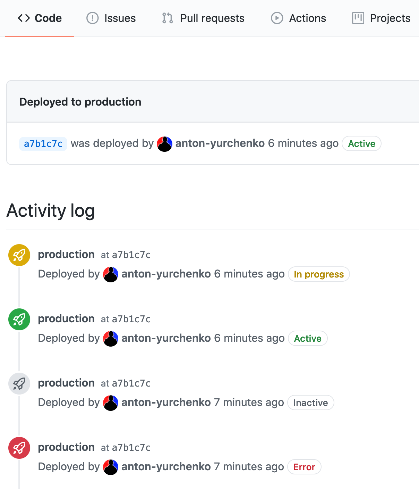

# action-github-deployment

[](https://github.com/ReasonSoftware/action-github-deployment/releases/latest)
[](https://goreportcard.com/report/github.com/ReasonSoftware/action-github-deployment)
[](https://hub.docker.com/r/reasonsoftware/action-github-deployment)
[](LICENSE.md)

A **GitHub Action** for a creation and status update of a **GitHub Deployment** during CD flow



## Features

- Easily create GitHub Deployments
- Update status of an existing deployments
- Custom GitHub Environments supported
- Incredibly fast! About 2MB docker image

## Manual

Just to add an action to your CD flow

```yaml
    - name: Create Deployment
      uses: docker://reasonsoftware/action-github-deployment:v1
      env:
        GITHUB_TOKEN: ${{ secrets.GITHUB_TOKEN }}
```

<details><summary>:information_source: Create a deployment and later update its status</summary>

```yaml
    - name: Create Deployment
      id: deployment
      uses: docker://reasonsoftware/action-github-deployment:v1
      env:
        GITHUB_TOKEN: ${{ secrets.GITHUB_TOKEN }}
    
    [...]

    - name: Update Status
      uses: docker://reasonsoftware/action-github-deployment:v1
      env:
        GITHUB_TOKEN: ${{ secrets.GITHUB_TOKEN }}
        DEPLOYMENT: ${{steps.deployment.outputs.id}}
        STATUS: success
```

You may also update the deployment to either `success` or `failure` in one step by providing an overall status as `FAIL` environmental variable:

```yaml
    [...]

    - name: Update Status
      uses: docker://reasonsoftware/action-github-deployment:v1
      env:
        GITHUB_TOKEN: ${{ secrets.GITHUB_TOKEN }}
        DEPLOYMENT: ${{steps.deployment.outputs.id}}
        STATUS: success
        FAIL: "${{ failure() }}"
```

</details>

<details><summary>:information_source: Create a deployment with non-default status</summary>

```yaml
    - name: Create Deployment
      uses: docker://reasonsoftware/action-github-deployment:v1
      env:
        GITHUB_TOKEN: ${{ secrets.GITHUB_TOKEN }}
        STATUS: in_progress
```

</details>

## Configuration

- `DEPLOYMENT` - existing deployment ID, required when updating status
- `STATUS` - status of a deployment, must be one of the following: `[ error, failure, inactive, in_progress, queued, pending, success ]`
- `ENVIRONMENT` - GitHub Environment, default `production`
- `FAIL`: failure trap which will tweak the status to be **failure** on value `"true"`. Used to reduce overal workflow code by configuring one action for both successful or failed deployments with `FAIL: "${{ failure() }}"`

## Notes

- This action is automatically built at [**Docker Hub**](https://hub.docker.com/r/reasonsoftware/action-github-deployment), and tagged with `latest / v1 / v1.2 / v1.2.3` allowing to lock against a certain version
*It's recommended to lock against a major version, for example* `v1`
- Docker image is published both to [**Docker Hub**](https://hub.docker.com/r/reasonsoftware/action-github-deployment) and [**GitHub Packages**](https://github.com/ReasonSoftware/action-github-deployment/packages). If you don't want to rely on **Docker Hub** but still want to use the dockerized action, you may switch from `uses: docker://reasonsoftware/action-github-deployment:v1` to `uses: docker://docker.pkg.github.com/reasonsoftware/action-github-deployment/action-github-deployment:v1`

## License

[Apache-2.0](LICENSE.md) © 2021 [Reason Cybersecurity Ltd.](https://www.reasonsecurity.com/)
